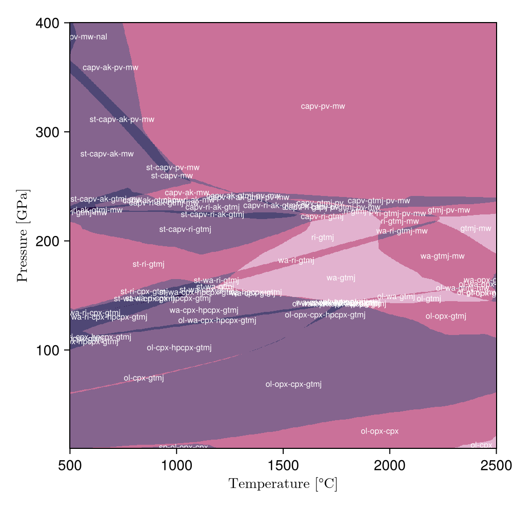

# Sprout.jl &nbsp; :seedling:

[](https://github.com/Philipsite/Sprout.jl/actions/workflows/CI.yml)
[](https://www.gnu.org/licenses/gpl-3.0)

A Julia package for surrogate modeling of multi-component phase equilibria — fast approximation of Gibbs energy minimisation using neural networks.



## Features

> [!NOTE]
> Sprout.jl is currently in early development. The API is subject to change in future releases.

- **Assemblage classification** — Predict stable mineral assemblages from bulk composition
- **Phase fraction & composition regression** — Predict phase fractions and solid-solution compositions
- **GPU acceleration** — Training and inference with CUDA support via [Flux.jl](https://github.com/FluxML/Flux.jl)
- **Training data generation** — Generate training datasets using [MAGEMin](https://github.com/ComputationalThermodynamics/MAGEMin)
- **Hyperparameter tuning** — Built-in utilities for model optimisation

Check out the [examples](examples/) directory for complete workflows.

## Installation

> [!NOTE]
> Sprout.jl is not yet registered in the General registry. To install, use the following command:

```julia
using Pkg
Pkg.add(url="https://github.com/Philipsite/Sprout.jl")
```

## Acknowledgements
### References
- *MAGEMin*: [Riel et al. (2022)](https://doi.org/10.1029/2022GC010427)

### Funding
This work was supported by the Swiss National Science Foundation (SNSF) trough the ThermoFORGE project under grant number [10007192](https://data.snf.ch/grants/grant/10007192).